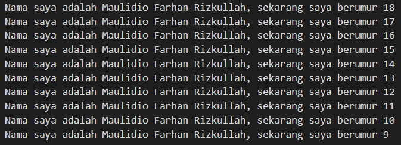

# Pemrograman Mobile - Pertemuan 1

Project Hello World 

NIM : 2141720041

NAMA : MAULIDIO FARHAN RIZKULLAH

## Soal 1

Kode:

```
void main(){
  for (int i = 10; i > 0; i--){
    print('Nama saya adalah Maulidio Farhan Rizkullah, sekarang saya berumur ${i + 8}');
  }
}
```

Output:



<br>

## Soal 2

Karena dart sendiri merupakan bahasa pemrograman yang digunakan untuk mengembangkan aplikasi dengan framework flutter, jadi sangat perlu untuk belajar dan memahami dart dahulu sebelum menggunakan flutter

## Soal 3

### Dart Operators
operator tidak lebih dari method yang didefinisikan dalam class dengan sintaks khusus.

ketika menggunakan operator seperti x == y, seolah olah sedang memanggil x.==(y) yang metode tersebut digunakan untuk melakukan perbandingan kesetaraan

### Arithmetic operators
`+` untuk tambahan

`-` untuk pengurangan

`*` untuk perkalian

`/` untuk pembagian

`~/` untuk pembagian bilangan bulat, setiap pembagian sederhana dengan `/` menghasilkan nilai double. untuk mendapatkan nilai bilangan bulat, perlu membuat semacam transformasi dalam bahasa pemrograman lain

`%` untuk operasi modulus 

`-expression` untuk negasi

### Increment and decrement operators 

`++var` atau `var++` untuk menambah nilai variabel var sebesar 1

`--var` atau `var--` untuk mengurangi nilai variabel var sebesar 1

### Equality and relational operators

`==` untuk memeriksa apakah operan sama

`!=` untuk memeriksa apakah operan berbeda

`>` memeriksa apakah operan kiri lebih besar dari operan kanan

`<` memeriksa apakah operan kiri lebih kecil dari operan kanan

`>=` memeriksa apakah operan kiri lebih besar dari atau sama dengan operan kanan

`<=` memeriksa apakah operan kiri kurang dari atau sama dengan operan kanan

### Logical operators

`!expression` negasi atau kebalikan hasil ekspresi—yaitu, true menjadi false dan false menjadi true.

`||` menerapkan operasi logika OR antara dua ekspresi.

`&&` menerapkan operasi logika AND antara dua ekspresi.

### Main Function

`void` adalah method yang tidak mengembalikan data apapun ketika telah di eksekusi

`main` adalah nama fungsi utama yang dicari Dart VM saat pertama kali mengeksekusi kode

`( )` tempat fungsi untuk mendefinisikan data yang akan diterima

`{ }` kurung kurawal buka dan tutup berfungsi untuk menentukan dimana kode function main dimulai dan berakhir

### perbedaan function dan method

function berada di luar class sedangkan method terikat pada turunan class dan memiliki referensi secara implisit ke instance class melalui keyword this.