# Pemrograman Mobile - Pertemuan 3

NIM : 2141720041

NAMA : MAULIDIO FARHAN RIZKULLAH

ABSEN : 19

KELAS : 3F

## Praktikum 1

### Langkah 1

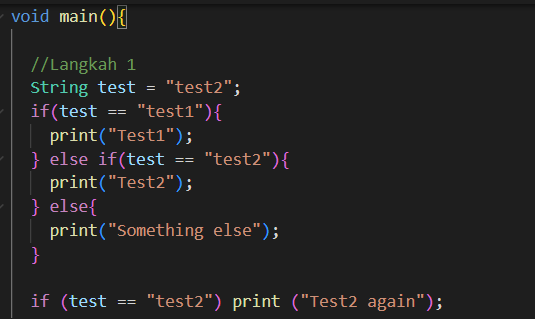

### Langkah 2
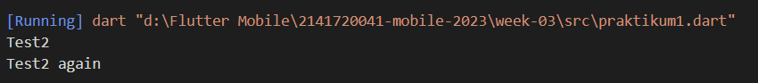
kode akan menampilkan "Test2" dan "Test2 again" karena pada pengecekan if pertama, jika variabel test bernilai test1 maka akan melakukan kondisi nya, sedangkan variabel test memiliki nilai test2, maka kondisi yang akan dijalankan ada pada else if yang kedua karena memiliki kondisi yang sama dengan variabel test. Setelah melewati if else yang pertama, maka kondisi akan berlanjut pada if yang kedua yaitu pada if yang bawah sendiri, karena kondisi if benar maka akan menampilkan print "Test2 again"

### Langkah 3

Akan terjadi error, karena variabel test bukan merupakan boolean sehingga akan menghasilkan error

Solusi:

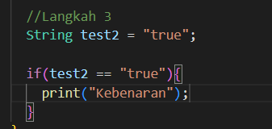

dengan memberi kondisi pada if yaitu jika variabel test2 == "true" (dengan kondisi nilai string yang sama) jika benar maka akan menghasilkan true, dan sebaliknya jika salah maka akan menghasilkan nilai false
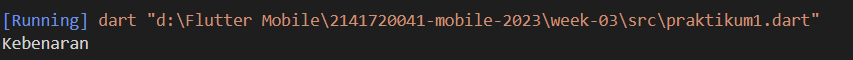

## Praktikum 2

### Langkah 1

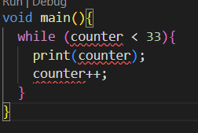

### Langkah 2

Akan terjadi error karena variabel counter belum dibuat

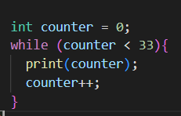

Penjelasan pada langkah 3

### Langkah 3

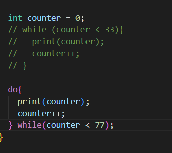

pada langkah 1, kondisi akan dijalankan terlebih dahulu sebelum perintah dijalankan, sedangkan pada langkah 3 perintah akan dijalankan terlebih dahulu, setelah itu kondisi akan dicek

## Praktikum 3

### Langkah 1

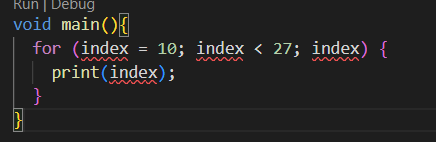

### Langkah 2

akan terjadi error karena variabel index belum dibuat

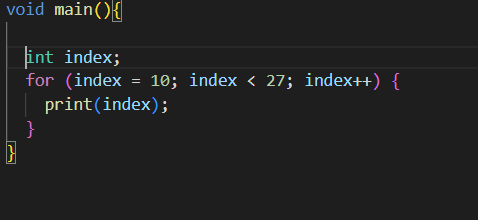

setelah variabel index dibuat, code akan berjalan tetapi nilai index akan tetap sehingga akan menyebabkan perulangan berjalan terus menerus tanpa memasuki stop condition, jadi solusi nya dengan menambahkan index++ pada kondisi for

### Langkah 3

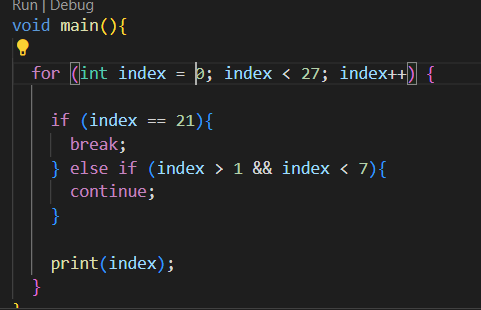

Hasil

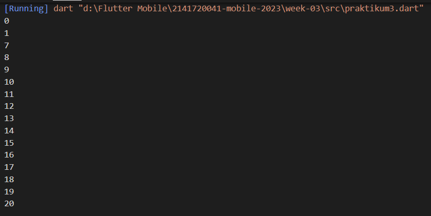

pada kode program yang diberikan pada praktikum, saya mengganti nilai variabel index dari 10 menjadi 0 untuk mengecek apakah kode berjalan dengan benar atau tidak, setelah di cek ternyata kode tidak berjalan dengan baik dikarenakan operator || tersebut membuat kondisi else if menjadi aneh, sehingga saya mengganti operator dengan &&, maka dengan operator tersebut, kondisi jika index lebih dari 1 dan kurang dari 7 akan dilakukan langsung pada perulangan selanjutnya tanpa melanjutkan kondisi dibawahnya, sedangkan jika nilai index telah mencapai nilai 21 maka akan dilakukan break pada perulangan

## Tugas Praktikum

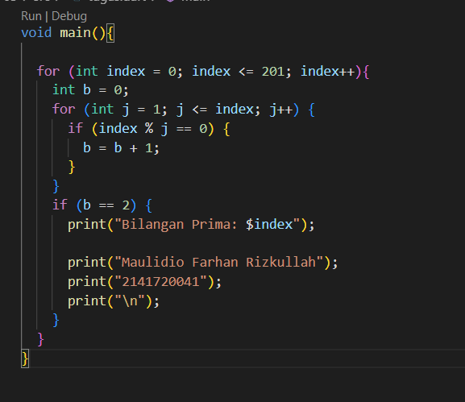

Hasil

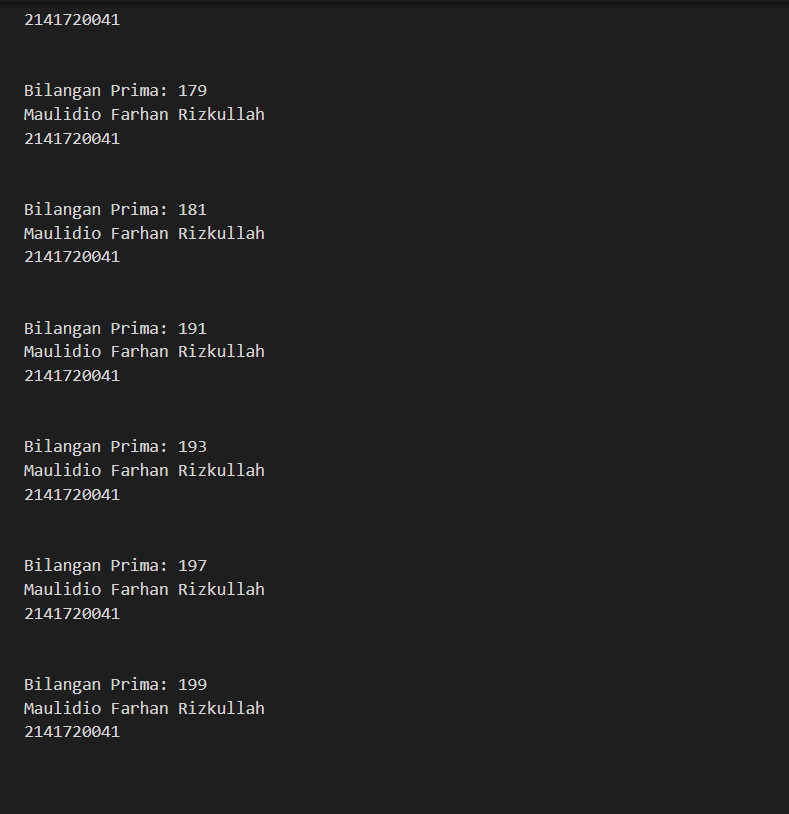

