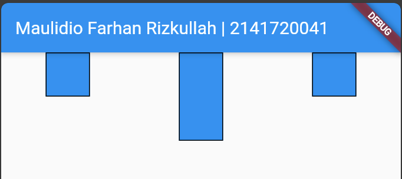
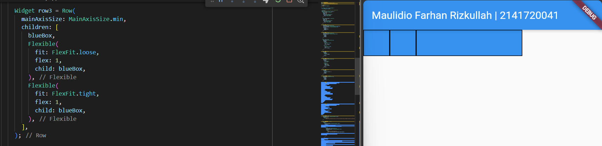

# Pemrograman Mobile - Pertemuan 7

NIM : 2141720041

NAMA : MAULIDIO FARHAN RIZKULLAH

ABSEN : 19

KELAS : 3F

## Praktikum 1
- Menambahkan widget titleSection yang digunakan untuk menampilkan tulisan dan icon dalam widget yang diatur dengan penggunaan row dan column

## Praktikum 2
- Menambahkan widget buttonSection yang akan digunakan untuk button navigasi, yang berisi icon dan menggunakan MainAxisAlignment.spaceEvenly untuk mengatur ruang kosong

## Praktikum 3
- Menambahkan widget textSection untuk menampilkan paragraf teks

## Praktikum 4
- Menambahkan gambar

## Tugas Codelabs
<br>

### Row and Column
- Widget Row digunakan untuk menyusun elemen-elemen secara horizontal
- Widget Column digunakan untuk menyusun elemen-elemen secara vertikal

| Row        | Column           |
| ------------- |:-------------:| 
|  |  |

### Axis size and alignment
- Axis mengacu pada arah seperti vertikal dan horizontal. terdapat 2 axis pada Flutter yaitu Main Axis dan Cross Axis.

- Contoh mainAxisAlignment

| start        | end           |
| ------------- |:-------------:| 
|  |  |

- Contoh crossAxisAlignment

| start        | end           |
| ------------- |:-------------:| 
|  |  |

### Flexible widget
- Digunakan untuk mengontrol elemen-elemen berperilaku secara fleksibel.


### Expanded widget
- Mirip dengan Flexible widget, Expanded widget dapat memaksa widget untuk mengisi ruang ekstra.


### SizedBox widget
- Digunakan untuk mengubah ukuran tinggi dan lebar widget 


### Spacer widget
- Digunakan untuk memberi space antar widget


### Text widget
- Digunakan untuk menampilkan text


### Icon widget
- Digunakan untuk menampilkan icon 


### Image widget
- Digunakan untuk menampilkan gambar
```dart
    Widget image = Row(
        mainAxisAlignment: MainAxisAlignment.center,
        children: [
            Image.network(
                'https://raw.githubusercontent.com/flutter/website/main/examples/layout/sizing/images/pic2.jpg'),
        ],
    );
```


### Tugas codelabs flutter
```dart
    Widget finalPart = Column(
      children: [
        Row(
          mainAxisAlignment: MainAxisAlignment.center,
          children: [
            Padding(
              padding: EdgeInsets.all(8),
              child: Icon(Icons.account_circle, size: 50),
            ),
            Column(
              mainAxisSize: MainAxisSize.min,
              crossAxisAlignment: CrossAxisAlignment.start,
              children: [
                Text(
                  'Maulidio Farhan Rizkullah',
                  style: Theme.of(context).textTheme.headlineSmall,
                ),
                Text(
                  'Experienced App Developer',
                ),
              ],
            ),
          ],
        ),
        SizedBox(
          height: 8,
        ),
        Row(
          mainAxisAlignment: MainAxisAlignment.spaceBetween,
          children: [
            Text(
              'Perumahan Kembang BB 05',
            ),
            Text(
              '+62 852 8958 9391',
            ),
          ],
        ),
        SizedBox(
          height: 16,
        ),
        Row(
          mainAxisAlignment: MainAxisAlignment.spaceAround,
          children: [
            Icon(Icons.accessibility),
            Icon(Icons.timer),
            Icon(Icons.phone_android),
            Icon(Icons.phone_iphone),
          ],
        ),
      ],
    );
```


