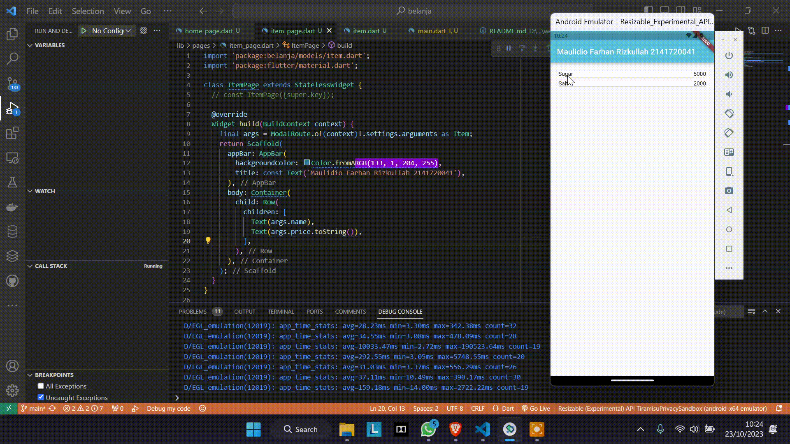

# Pemrograman Mobile - Pertemuan 8

NIM : 2141720041

NAMA : MAULIDIO FARHAN RIZKULLAH

ABSEN : 19

KELAS : 3F

## Praktikum 5

## Tugas Praktikum 2
1. ```dart
    onTap: () {
                Navigator.pushNamed(context, '/item', arguments: item);
              },
    ```
- dengan menambahkan 'arguments: item' pada Navigator dapat dilakukan pengiriman data ke halaman berikutnya
2. 
- dengan menggunakan ModalRoute nilai dapat dibaca di halaman ItemPage

### Hasil Akhir

- Dengan menggunakan Hero Widget dapat dilihat jika membuka halaman berikutnya yang telah diberi hero widget maka akan muncul animasi transisi