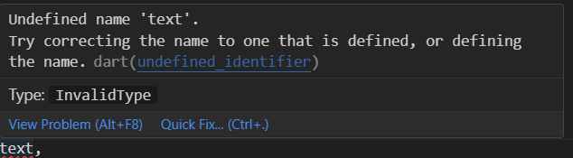
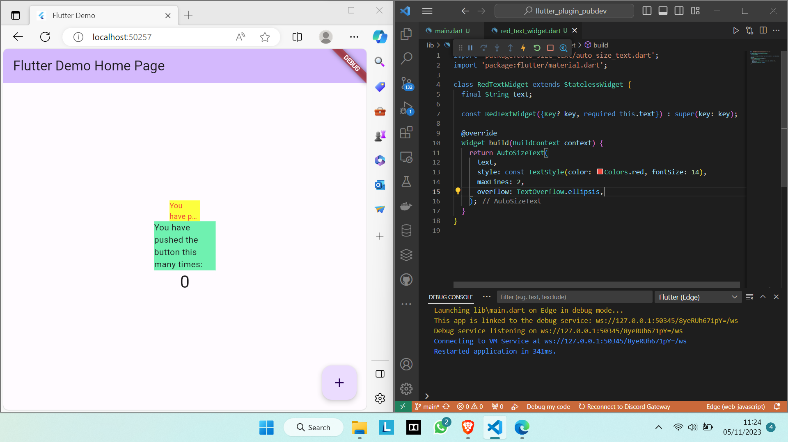

# Pemrograman Mobile - Pertemuan 10

NIM : 2141720041

NAMA : MAULIDIO FARHAN RIZKULLAH

ABSEN : 19

KELAS : 3F

## Praktikum
- Info Error

Error tersebut terjadi dikarenakan variabel text masih belum didefinisikan sehingga tidak dapat langsung dipanggil

- Hasil

- Widget pertama yaitu RedTextWidget menghasilkan text warna merah sedangkan widget Text menghasilkan text warna hitam.

## Tugas Praktikum
2. Fungsi flutter pub add auto_size_text digunakan untuk menambahkan paket atau dependensi Flutter bernama "auto_size_text" ke dalam proyek Flutter, jika berhasil ditambahkan, akan tampil nama plugin beserta versinya di file pubspec.yaml di bagian dependencies.

    

3. Pada langkah ke lima, penambahan variabel text diperlukan agar tidak terjadi error pada langkah ke empat. setelah itu, dengan menambahkan parameter pada constructor, widget ini dapat menerima sebuah parameter text yang digunakan untuk menentukan teks yang akan ditampilkan dalam warna merah di dalam widget tersebut. Parameter ini harus disediakan saat membuat instance dari RedTextWidget.

4. - RedTextWidget adalah widget yang ditentukan sendiri (custom widget) yang menerapkan teks berwarna merah pada teks yang diberikan.
    - Widget 'Text' merupakan widget bawaan flutter.

    Perbedaan utama antara keduanya adalah bahwa yang pertama menggunakan widget kustom (RedTextWidget) untuk menampilkan teks dengan warna merah sementara yang kedua langsung menggunakan widget Flutter standar (Text). Widget custom memiliki lebih banyak kendali untuk menentukan tampilan teks, sementara Text adalah widget bawaan yang lebih sederhana untuk menampilkan teks tanpa banyak opsi tampilan tambahan.

5. - key: Mengendalikan bagaimana satu widget menggantikan widget lain dalam tree widget.
    - textKey: Mengatur kunci (key) untuk widget Text hasil.
    - style: Menentukan gaya (seperti ukuran font, warna, dll) yang akan digunakan untuk teks.
    - minFontSize: Batasan ukuran font minimum yang digunakan saat menyesuaikan ukuran teks. Akan diabaikan jika presetFontSizes diatur.
    - maxFontSize: Batasan ukuran font maksimum yang digunakan saat menyesuaikan ukuran teks. Akan diabaikan jika presetFontSizes diatur.
    - stepGranularity: Ukuran langkah di mana ukuran font beradaptasi dengan batasan.
    - presetFontSizes: Menentukan ukuran font yang mungkin digunakan. Harus dalam urutan menurun.
    - group: Menyinkronkan ukuran dari beberapa widget AutoSizeText.
    - textAlign: Menentukan cara teks diatur secara horizontal.
    - textDirection: Menentukan arah teks, memengaruhi cara textAlign seperti TextAlign.start dan TextAlign.end diinterpretasikan.
    - locale: Digunakan untuk memilih font ketika karakter Unicode yang sama dapat dirender dengan berbeda tergantung pada lokasi.
    - softWrap: Menentukan apakah teks dapat patah di pemisahan baris yang lembut.
    - wrapWords: Menentukan apakah kata-kata yang tidak muat dalam satu baris harus dibungkus. Defaultnya adalah true agar berperilaku seperti widget Text.
    - overflow: Menentukan cara penanganan tampilan jika teks melebihi batasnya.
    - overflowReplacement: Jika teks melebihi batasnya, widget ini akan ditampilkan sebagai pengganti.
    - textScaleFactor: Jumlah piksel font untuk setiap piksel logis. Juga memengaruhi minFontSize, maxFontSize, dan presetFontSizes.
    - maxLines: Batasan maksimum jumlah baris yang akan ditampilkan oleh teks.
    - semanticsLabel: Label semantik alternatif untuk teks ini.