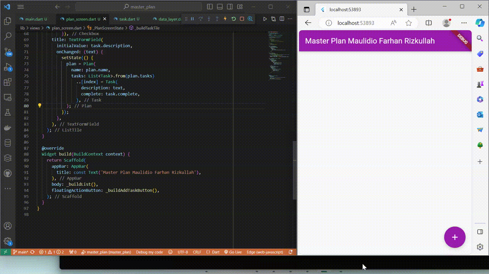
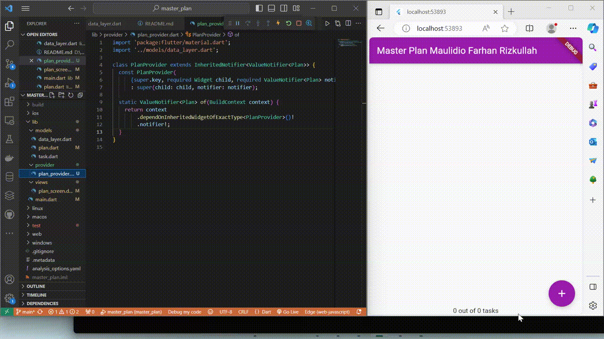

# Pemrograman Mobile - Pertemuan 11

NIM : 2141720041

NAMA : MAULIDIO FARHAN RIZKULLAH

ABSEN : 19

KELAS : 3F

## Praktikum 1

2. pada langkah ke 4, pernyataan export digunakan untuk mengekspor fungsi, kelas, atau library dari satu file ke file lain. export 'plan.dart'; dan export 'task.dart'; digunakan untuk mengekspor class yang didefinisikan di dalam file plan.dart dan task.dart sehingga dapat diakses oleh file lain yang mengimpor file ini.

3. variabel plan digunakan untuk menyimpan data yang ingin ditampilkan atau dimanipulasi di halaman ini, sedangkan penggunaan const karena class Plan bertipe data const

4. 
    Pada praktikum ini menghasilkan tampilan berupa listView yang berisi text dan dapat ditambahkan listview baru pada button yang terdapat di pojok kanan bawah, terdapat juga checkbox yang digunakan untuk ceklist jika daftar list telah selesai dilakukan.

5. initState sering digunakan untuk melakukan inisialisasi yang diperlukan untuk State, seperti memuat data awal, menginisialisasi kontroler, atau mendaftarkan listener. Sedangkan dispose sering digunakan untuk membersihkan sumber daya yang tidak lagi diperlukan, seperti membatalkan langganan, menutup koneksi, atau menghapus listener.

## Praktikum 2

2. InheritedNotifier adalah spesialisasi dari InheritedWidget yang dikombinasikan dengan Notifier, yang biasanya digunakan untuk mengelola keadaan terkait dengan perubahan pada widget dan membangun ulang widget ketika ada perubahan. Pada langkah 1, InheritedNotifier<ValueNotifier<Plan>> adalah jenis spesifik dari InheritedWidget yang berisi Notifier berupa ValueNotifier<Plan>.

3. Method int get completedCount digunakan untuk mendapatkan jumlah tugas yang sudah selesai dari daftar tugas, sedangkan method String get completenessMessage digunakan untuk menampilkan tulisan berapa banyak tugas yang sudah selesai dari total tugas yang ada.

4. 
    Pada praktikum ini dilakukan pembuatan InheritedWidget yang berfungsi untuk melakukan perubahan value jika ada perubahan pada list. 

## Praktikum 3

2. Pada diagram tersebut, berdasarkan hasil yang telah saya kerjakan pada praktikum 3, diagram bagian kiri menunjukkan Page utama yang berisi list dari Page page baru yang telah dibuat. Pada diagram bagian kanan menunjukkan page baru PlanScreen yang akan dibuat jika user menambahkan list baru pada page utama, pada page baru berisi listview text. Diagram bagian kanan akan membentuk struktur PlanScreen baru jika user menambahkan list pada page utama.

3. 

