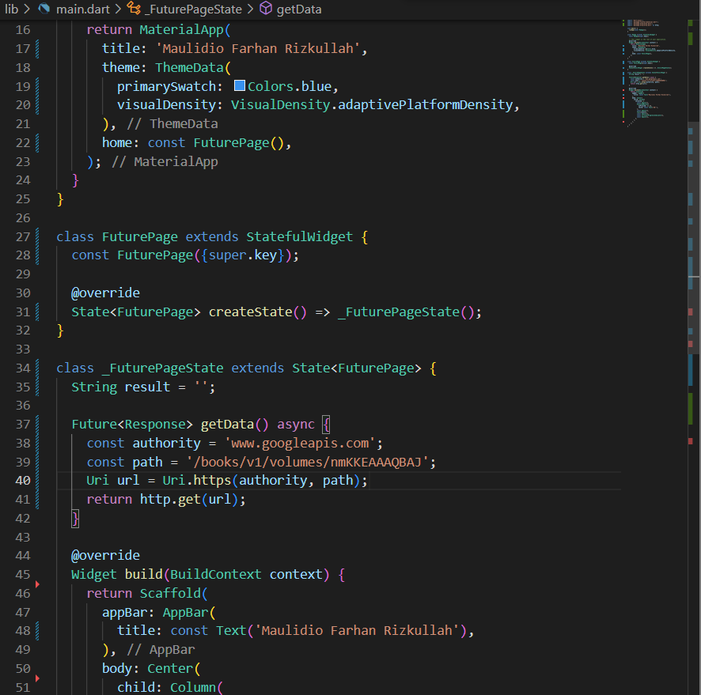
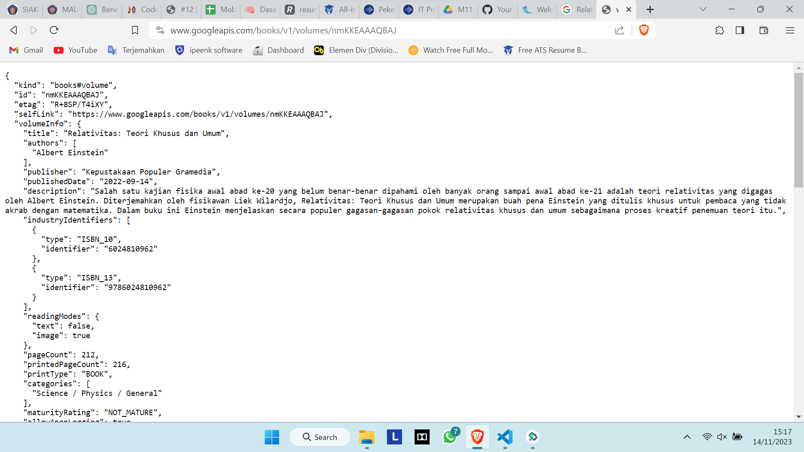
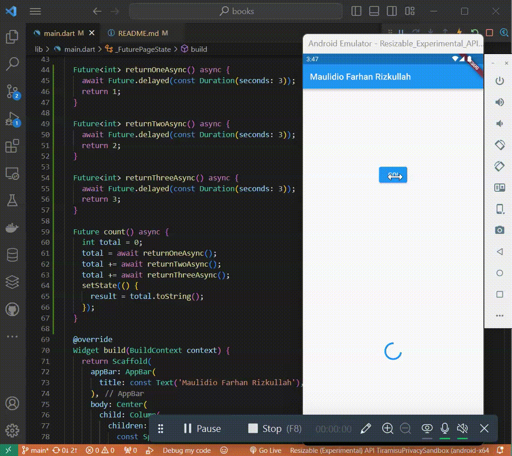
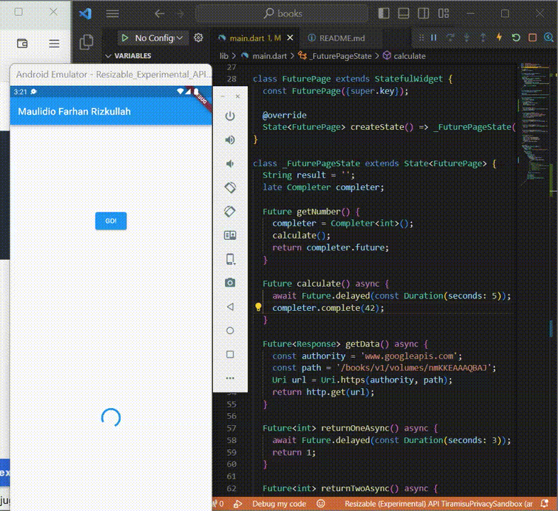
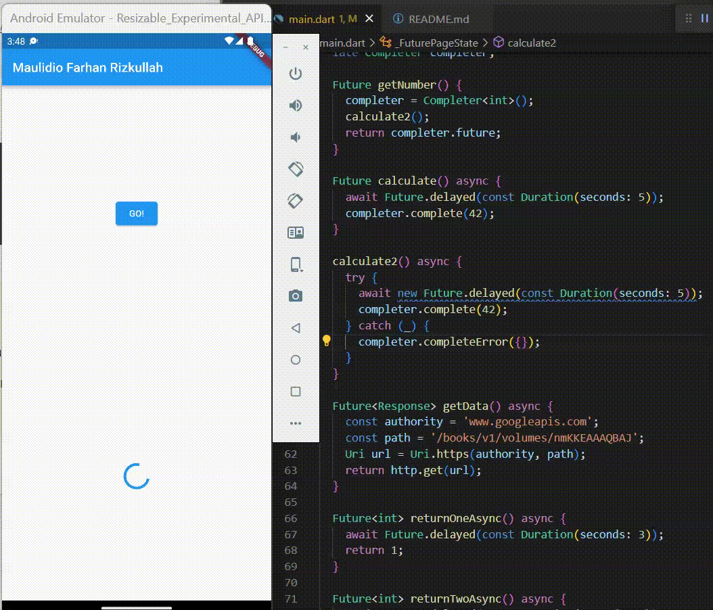
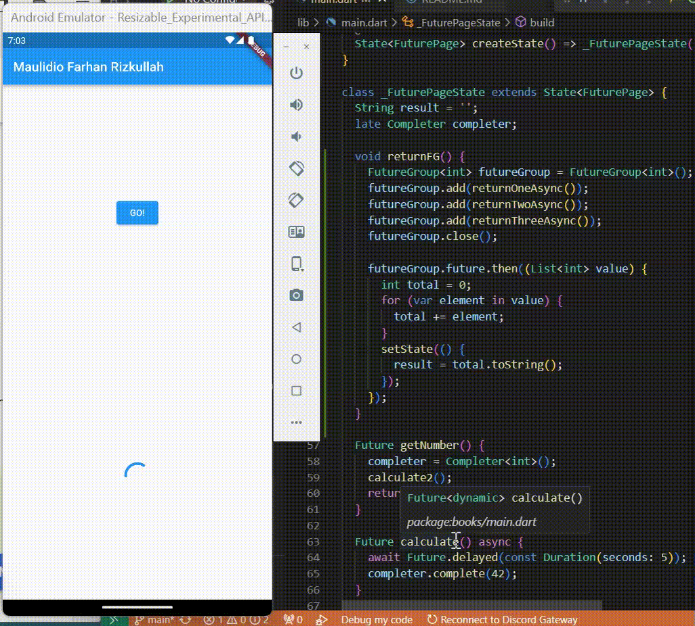
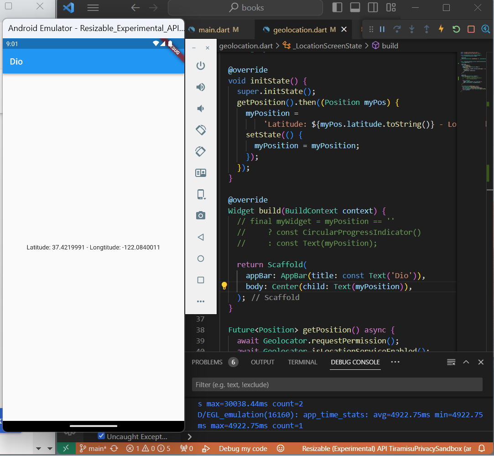
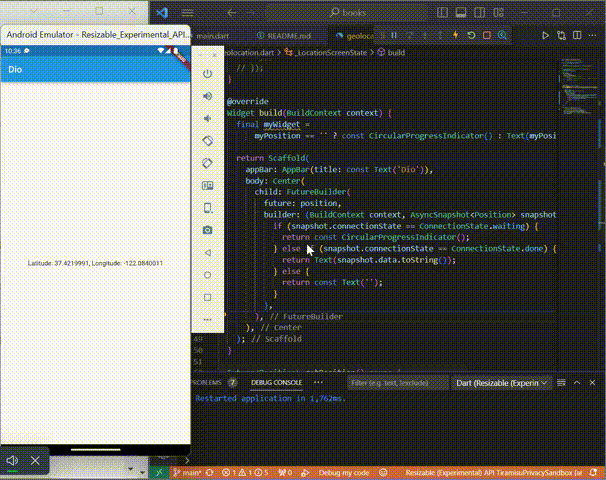
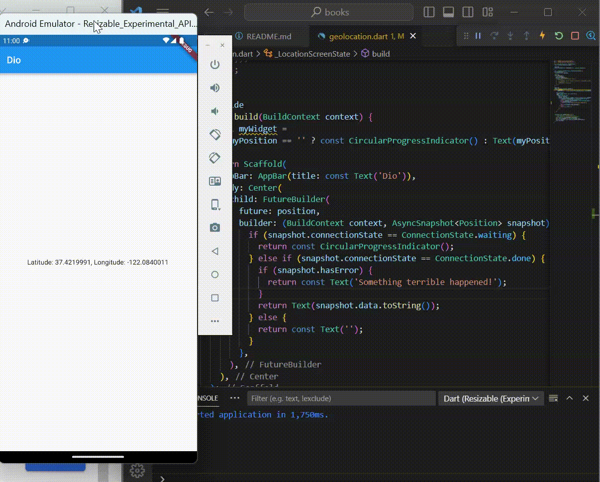

# Pemrograman Mobile - Pertemuan 12

NIM : 2141720041

NAMA : MAULIDIO FARHAN RIZKULLAH

ABSEN : 19

KELAS : 3F

## Praktikum 1

### Soal 1

### Soal 2

### Soal 3

 substring digunakan untuk mendapatkan bagian tertentu dari suatu string berdasarkan indeks awal dan akhir. Sedangkan catchError digunakan untuk menangani dan memproses error yang terjadi selama eksekusi operasi asynchronous.

## Praktikum 2

### Soal 4

Pada langkah 1 berisi 3 method Future<int> yang masing masing berfungsi mengembalikan nilai setelah menunggu selama 3 detik menggunakan Future.delayed. Sedangkan pada langkah 2 digunakan untuk menghitung jumlah nilai dari ketiga fungsi sebelumnya yang dipanggil. hal ini akan memakan waktu selama total 9 detik karena masing masing dari fungsi langkah 1 memiliki delay 3 detik, jadi butuh waktu total 9 detik untuk memperolah hasil dari pemanggilan fungsi count

## Praktikum 3

### Soal 5

Future getNumber digunakan untuk membuat objek Completer baru yang kemudian memanggil fungsi calculate yang digunakan untuk melakukan perhitungan dengan durasi 5 detik dan mengatur nilai completer menjadi 42 yang selanjutnya mengembalikan hasil Future dari Completer

### Soal 6

Pada hasil tidak menunjukkan perbedaan signifikan tetapi pada langkah 5-6, calculate2 menggunakan try catch untuk menangani exception. Jika terjadi exception, completer.completeError({}); akan dipanggil.

## Praktikum 4

### Soal 7

### Soal 8
FutureGroup dapat menambahkan beberapa Future ke dalam group untuk diproses sehingga lebih bersifat dinamis. Sedangkan Future.wait, isi didalam future sudah bersifat tetap, jadi jika ingin menambahkan harus secara manual, tidak seperti FutureGroup yang menggunakan add untuk menambahkan future yang mau dijalankan.

## Praktikum 5

### Soal 9

### Soal 10
Pada handleError(), jika ada exception yang dihasilkan returnError(), catch akan menangkap dan setState akan mengupdate state dengan pesan error, finally akan tetap jalan meskipun ada exception. Pada fungsi returnError(), Future menjalankan operasi asinkron yang kemudian menjalankan Exception setelah dilakukan delay selama 2 detik.

## Praktikum 6

### Soal 12

Ketika Geolocator.getCurrentPosition() dipanggil, browser akan menggunakan fungsi geolokasi browser dan memberikan hasil koordinat simulasi. library geolocator otomatis menggunakan API geolokasi HTML5 yang tersedia di browser untuk mendapatkan koordinat GPS

## Praktikum 7

### Soal 13

tidak ada perbedaan UI karena masih menggunakan layout yang sama. Pada kode sebelumnya, variabel myPosition digunakan langsung dalam widget myWidget, sedangkan pada kode ini menggunakan FutureBuilder untuk membuat widget berdasarkan status future. Hasil dari pemanggilan getPosition() disimpan pada variabel position yang digunakan sebagai future pada FutureBuilder. 

### Soal 14

Tidak ada perbedaan UI karena hanya menambahkan errorhandling, perbedaan akan terlihat jika terjadi kesalahan dan akan menampilkan teks kesalahan.

## Praktikum 8

### Soal 16

Setiap button salah 1 warna di klik, maka akan merubah warna dari halaman sebelumnya, hal ini karena Navigation.pop() pada masing masing button berisi parameter color yang telah ditentukan pada button tersebut sehingga ketika di klik maka Navigation.pop() akan merubah warna background sesuai button warna yang di klik.