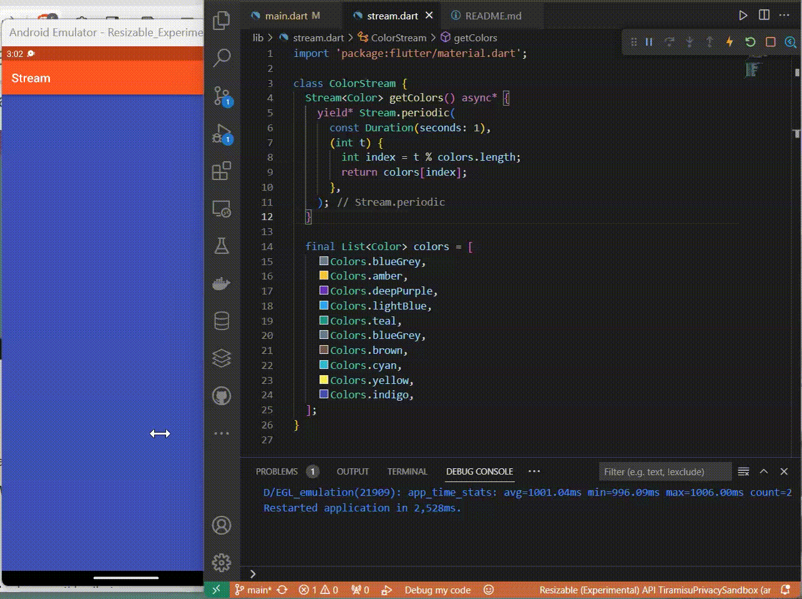

# Pemrograman Mobile - Pertemuan 13

NIM : 2141720041

NAMA : MAULIDIO FARHAN RIZKULLAH

ABSEN : 19

KELAS : 3F

## Praktikum 1

### Soal 3
yield* digunakan dalam fungsi generator untuk menggabungkan atau mentebar nilai-nilai dari suatu terable ke dalam iterable yang sedang dibuat.

fungsi getColors menghasilkan suatu Stream<Color> yang mengeluarkan warna-warna dari daftar colors pada interval waktu satu detik menggunakan Stream.periodic

### Soal 4

### Soal 5

pada penggunaan await for, changeColor akan menunggu setiap peristiwa sebelum melanjutkan ke peristiwa berikutnya. Sedangkan pada penggunaan listen, kode bisa melanjutkan eksekusi tanpa menunggu peristiwa selanjutnya