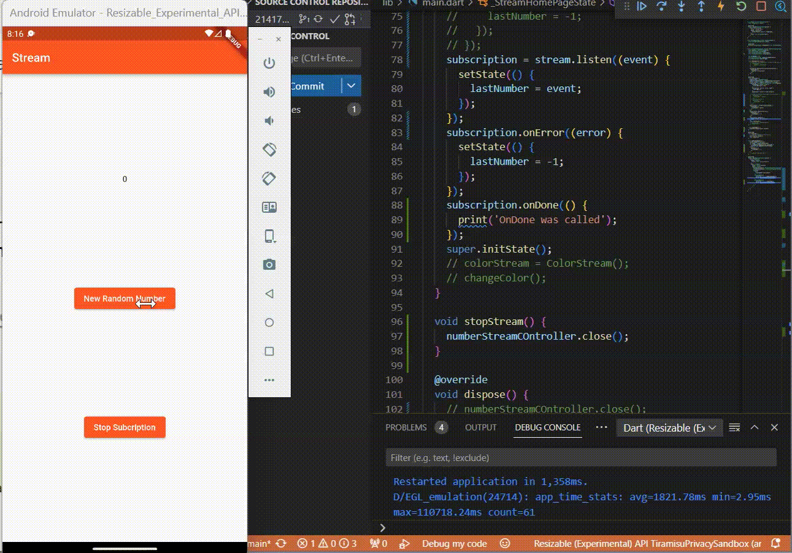

# Pemrograman Mobile - Pertemuan 13

NIM : 2141720041

NAMA : MAULIDIO FARHAN RIZKULLAH

ABSEN : 19

KELAS : 3F

## Praktikum 1

### Soal 3
yield* digunakan dalam fungsi generator untuk menggabungkan atau mentebar nilai-nilai dari suatu terable ke dalam iterable yang sedang dibuat.

fungsi getColors menghasilkan suatu Stream<Color> yang mengeluarkan warna-warna dari daftar colors pada interval waktu satu detik menggunakan Stream.periodic

### Soal 4

### Soal 5

pada penggunaan await for, changeColor akan menunggu setiap peristiwa sebelum melanjutkan ke peristiwa berikutnya. Sedangkan pada penggunaan listen, kode bisa melanjutkan eksekusi tanpa menunggu peristiwa selanjutnya

## Praktikum 2

### Soal 6

Pada langkah 8 dilakukan inisialisasi objek stream dan controller dari objek NumberStream. Setelah itu menggunakan listen untuk mendaftarkan fungsi callback yang akan dipanggil setiap ada perubahan atau data baru. Dalam fungsi callback,, menggunakan setState untuk memperbarui state widget dengan nilai terbaru yang diterima dari aliran data. Nilai disimpan dalam variabel lastNumber.

Pada langkah 10 addRandomNumber() digunakan untuk mneghasilkan bilangan acak antara 0 sampai 9 menggunakan class Random, yang kemudian menambahkan bilangan ke aliran data numeric menggunakan objek numberStream.

### Soal 7
method addError() digunakan untuk menambahkan pesan error ke dalam sink yang terkait dengan controller. method onError ditambahkan ke hasil pemanggilan listen pada objek stream untuk penanganan error. Ketika error, callback onError akan dijalankan dan akan mengubah state widget dengan menetapkan nilai lastNumber menjadi -1.

## Praktikum 3

### Soal 8

pada langkah 1-3 menunjukkan penggunaan StreamTransformer yang digunakan untuk mengubah nilai dalam aliran data numerik dengan mengkalikannya dengan 10, serta memberikan penanganan error untuk mengatasi error pada proses transformasi.

## Praktikum 4

### Soal 9

variabel subscription akan menerima hasil dari listen, yang pada langkah 6 digunakan untuk memberhentikan subscription yang berarti widget tidak akan berlangganan perubahan pada aliran data setelah method dispose() dipanggil. Pada langkah 8 dilakukan kondisi dimana jika numberStramController.isClosed true maka lastNumber di set menjadi -1, dan jika false maka numberStreamm.addNumberToSink(myNum) akan dijalankan

